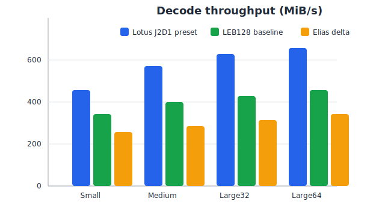
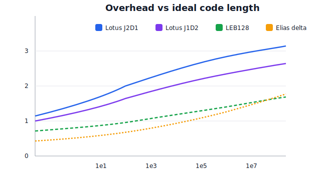

# Lotus 🪷

[](https://github.com/example/lotus/actions)
[](https://crates.io/crates/lotus)
[](LICENSE)

Lotus is a parametric, density-reclaiming integer codec for Rust that turns wasted alias space into real payload capacity.

## Why Lotus?

Byte-quantized varints and unary-style universal codes leave code space on the table. Lotus unfolds the binary tree so every distinct bitstring is used, then caps the result with a tiny tiered header anchored by a fixed-width jumpstarter. The result is a smooth, dense curve that stays prefix-decodable across massive ranges.

## Quick comparison

Lotus is tunable; the size curve depends on `(J, d)` and on how wide a range you need to cover. See the config sweep (with coverage) in [docs/RESULTS.md](docs/RESULTS.md) and the methodology in [docs/BENCHMARKS.md](docs/BENCHMARKS.md).



## Installation

Library:

```bash
cargo add lotus
```

CLI:

```bash
cargo install --path .
```

## Usage

Library quick start:

```rust
use lotus::{lotus_encode_u64, lotus_decode_u64, LOTUS_J2D1};

let encoded = lotus_encode_u64(42, LOTUS_J2D1.0, LOTUS_J2D1.1)?;
let (decoded, _bits) = lotus_decode_u64(&encoded, LOTUS_J2D1.0, LOTUS_J2D1.1)?;
assert_eq!(decoded, 42);
```

CLI encoding/decoding:

```bash
echo 42 | lotus encode --jumpstarter 2 --tiers 1 | lotus decode --jumpstarter 2 --tiers 1
```

Benchmarks:

```bash
lotus benchmark
```

## Current status

Experimental research implementation with production-oriented ergonomics. APIs are stabilizing; performance work and fuzzing are ongoing.

## Resources

* [WHITEPAPER](docs/WHITEPAPER.md)
* [THEORY](docs/THEORY.md)
* [API](docs/API.md)
* [BENCHMARKS](docs/BENCHMARKS.md)
* [GitHub Pages demo](docs/index.html)



## Examples

Run examples with `cargo run --example <name>`:

* `basic_usage`
* `streaming`
* `configuration_tuning`
* `vs_varint`

## Contributing

See [CONTRIBUTING.md](CONTRIBUTING.md). Coverage is reported via Codecov and CI runs tests/benches on PRs.
